# Proposal

I am interested in examining the relationships between school performance, race, and socioeconomic indicators (including income and percentage of "economically disadvantaged"^[I use the Louisiana Department of Education’s data on percentages of economically disadvantaged students. I have yet to find sufficient metadata explaining how they define "economically disadvantaged," but comparing current school and school district performance reports with past reports suggests that this may be the percentage of students on free or reduced lunch plans.] students). Furthermore, I am interested in examining this data within the context of school district "secession."^[See @lockhart_smaller_2019 for a thorough explanation of the school district "secession" phenomenon.] I have chosen to focus on schools within East Baton Rouge Parish, Louisiana for two reasons: (1) there are stark differences among school districts with regard to school and school district performance,^[@lussier_baton_2019] and (2) residents in the southeast corner of the Parish recently voted to incorporate as the City of St. George with the intention of forming a new school district.^[@vincent_city_2019] If successful in creating a new school district, St. George will be the fourth new district to “secede” from the original East Baton Rouge Parish School District in two decades.

I propose to investigate the following research questions:

* Is there evidence that suggests the clustering of racial groups in East Baton Rouge (EBR) Parish?
* Is there evidence of the clustering of income levels in EBR Parish?
* Is there evidence of racial stratification of income?
* Is there evidence to suggest that school performance is linked to the racial makeup of the student body, the percentage of economically disadvantaged students, and/or the percentage of students fully proficient in English?

# Abstract

# Introduction

School district secession in the U.S. is propelling the re-segregation of public schools and school districts across the nation.^[@lockhart_smaller_2019] Two metrics commonly used to assess segregation include (1) “exposure” or “isolation,” which measure the relative proportion of racial groups in distinct geographic areas (schools, school districts, census block groups, counties, etc.), and (2) “unevenness,” which is concerned with the distribution of racial groups across these geographic regions.^[@chang_data_2018]

Another piece of this puzzle is the racial segregation between private versus public schools. This could be a significant factor fueling the difference in racial compositions between the total populations of residential areas and their public student populations. For example, if private schools tend to have significantly higher shares of White students than public schools in the same geographic region, this may help explain why public student populations tend to be significantly less White than the total residential populations of school districts.

I have chosen to use East Baton Rouge Parish in Louisiana as a case study because this Parish is split into multiple school districts, which is not the case for many parishes in Louisiana (and counties across the South, generally speaking). Furthermore, there has been a marked difference in school performance among these districts, with Zachary Community School District consistently performing as the top-ranked school district in the state, Central Community School District regularly performing in the top five school districts in the state, and both East Baton Rouge Parish School District and City of Baker School District generally scoring in the bottom fifteen school districts in the state.^[@noauthor_2018_2018-1] There is therefore a clear disparity among school districts in this region with respect to school quality. I am interested in investigating whether there are similar disparities among East Baton Rouge Parish school districts with regard to race and socioeconomic indicators.

East Baton Rouge Parish is no stranger to this school district “splintering” phenomenon. Originally, the entire Parish comprised a single school district, the East Baton Rouge Parish School System. Then, in 2003, both Zachary Community School District and the City of Baker School District formed, largely based on the incorporated regions of the two pre-existing cities. In 2007, another section of the East Baton Rouge Parish School District split off to form Central Community School District in the eastern part of the Parish. The Central Community School District was allowed to form only after the region incorporated into a city.^[@lussier_second_2019] In 2012 and 2013, residents of the southeast section of East Baton Rouge Parish began petitioning to form a new school district.^[@lussier_second_2019] Their initial efforts ultimately fell short, but after waiting the mandated time period, the group began petitioning again in March 2018 with the intention of following Central’s example: residents planned to incorporate as the City of St. George in order to subsequently form a new school district based on the incorporated region.^[@lussier_second_2019] According to U.S. Census survey estimates, there were approximately 16,300 students from kindergarten through 12th grade in census tracts fully or partly included within the City of St. George boundaries, 7,700 of whom were enrolled in private schools.^[@lussier_st_2019]

# Methods
\label{sec:methods}

I gathered data from the Louisiana Department of Education, the U.S. Department of Education’s National Center for Education Statistics, East Baton Rouge GIS Open Data, the U.S. Census Bureau, and the City of St. George’s website.

Feature classes used in the final project include:

- East Baton Rouge Parish boundary (polygon)
-	U.S. Census Bureau Unified School Districts for Louisiana (polygon)
-	East Baton Rouge Parish schools (point)
-	St. George area (polygon)
-	East Baton Rouge Parish Census Block Groups (polygon)

Tabular data joined to spatial feature classes include:

- East Baton Rouge private schools’ enrollment by race data for 2017-2018 academic year
-	East Baton Rouge public schools’ enrollment by race, school performance scores, percentage of economically disadvantaged students, and percentage of fully English proficient students data for 2017-2018 academic year
-	School district enrollment by race and school district performance scores for 2017-2018 academic year

After downloading these various data sources, I then performed the following operations: data cleaning, file format conversion, new field calculation, attribute table editing, table joining, clipping, selecting by location, and selecting by attribute. I cleaned the tabular data extensively in R and converted the .xls files to .csv files so as to prevent significant issues in importing the data into my ArcMap project. For the City of St. George polygon layer, I downloaded the KML file from Google Maps linked on the St. George website; I then used ArcCatalog to convert the KML file to a layer package I could import into ArcMap. Once I added the layers in ArcMap and created a geodatabase for the project in which I saved the various files, I began calculating new fields based on existing variables in the attribute tables. Namely, I calculated the percentage of White students and the percentage of non-White students for each school and school district in the Louisiana Department of Education data tables. I joined the Louisiana Department of Education school enrollment and performance data table and the National Center for Education Statistics private school data to the East Baton Rouge Parish schools point feature class, keeping only the records with corresponding matches (colleges and universities, for example, were included in the East Baton Rouge Parish schools layer, but they were not relevant to my analysis). I clipped the U.S. Census Bureau Unified School Districts for Louisiana to only select those within the East Baton Rouge Parish boundary. Then, I joined the Louisiana Department of Education school district performance data table to the school districts feature class. This was only possible after I started an editing session and edited values in the “School System” field of the tabular data to ensure that the names matched exactly with the names used in the East Baton Rouge Parish school districts feature class (for example, the “City of Baker School District” does not match “Baker City School District” even though they refer to the same school district).

- Census Block Groups Analysis
  - Spatial Weights Matrix: Queen's case first-order
  - Local Moran's I
  - Local Moran's I with EB rates
  - Bivariate Local Moran's I
  - Schools Analysis
  - Spatial Weights Matrix: distance band (distance threshold = 14732 ft such that every point has a minimum of 1 neighbor); inverse distance weighting (power = 1); max neighbors = 19
  - OLS Regression
  - Spatial Regression

# Exploratory Data Analysis

## Median Household Income
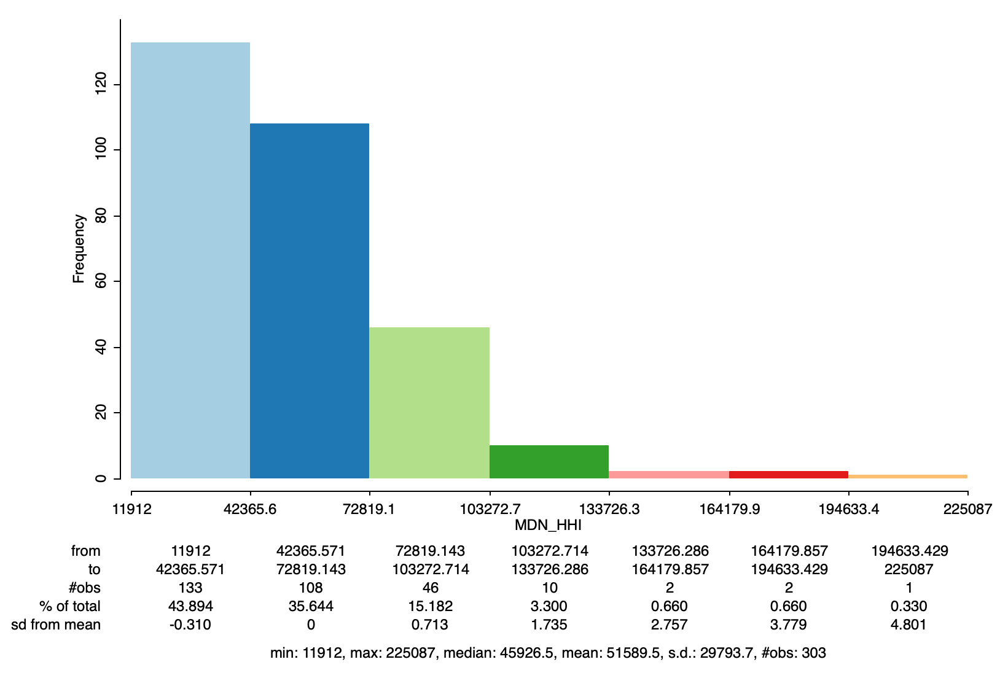

## Population Percentage White

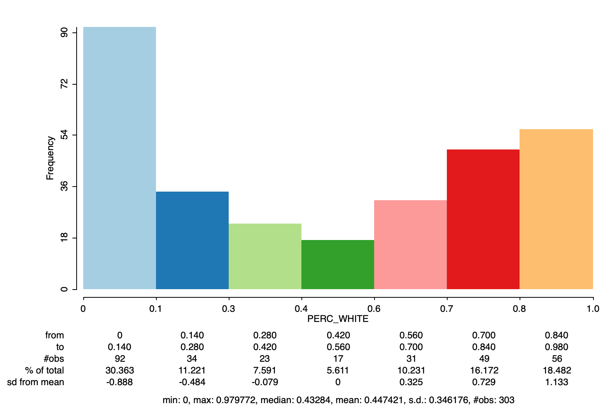

### Most White
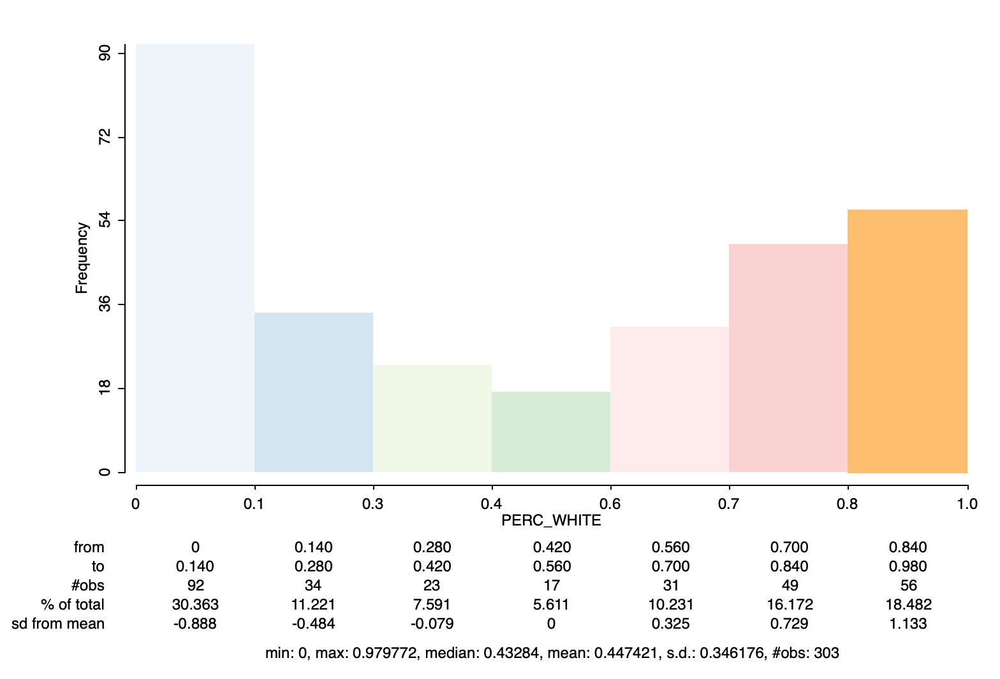

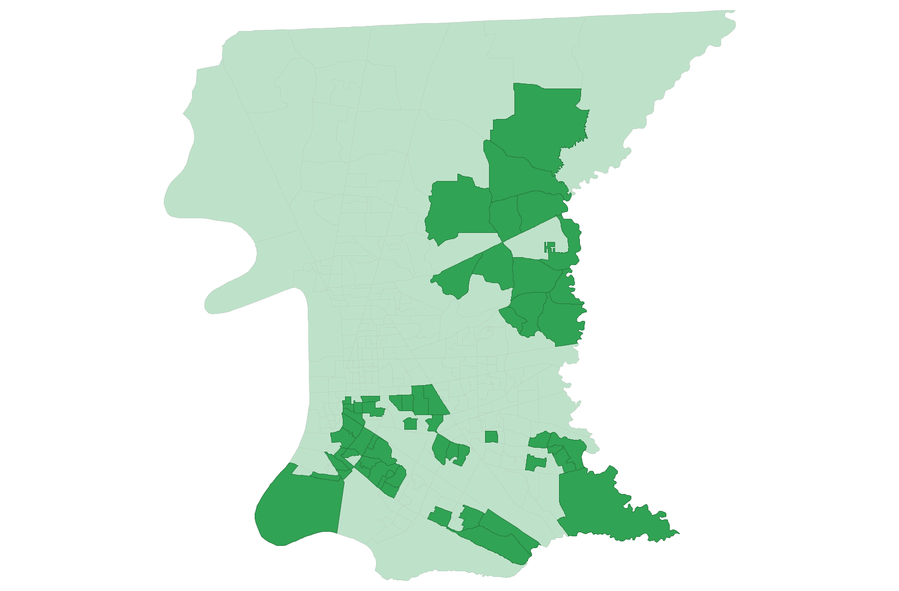

### Least White
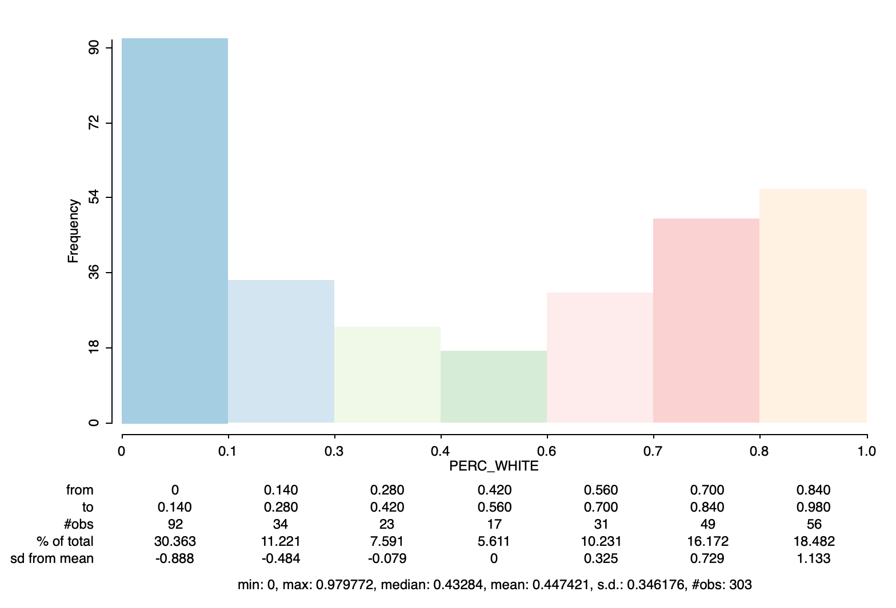

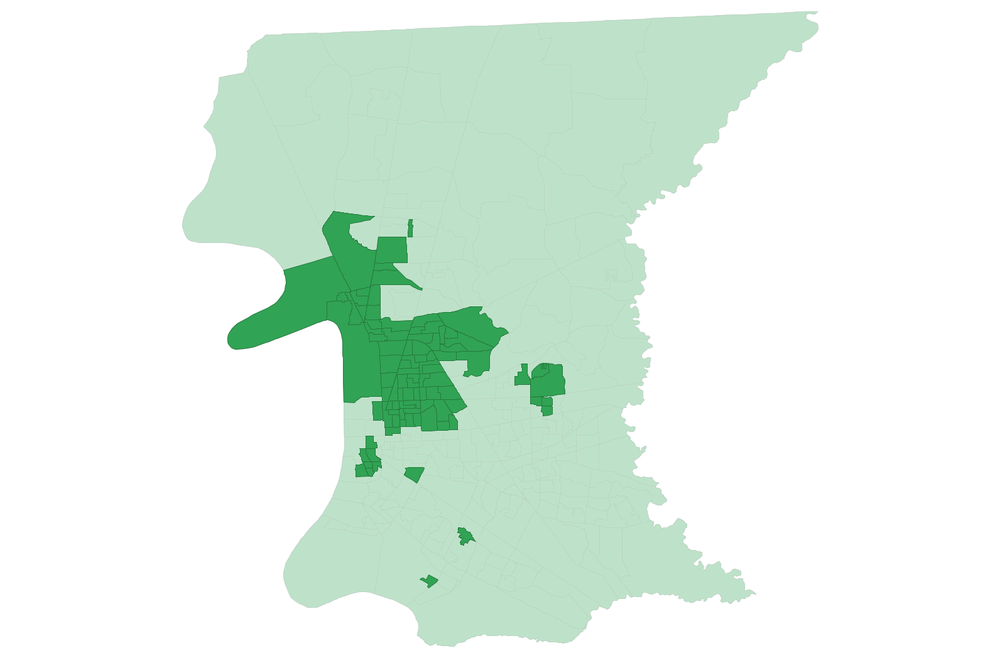

## Bivariate Relationships
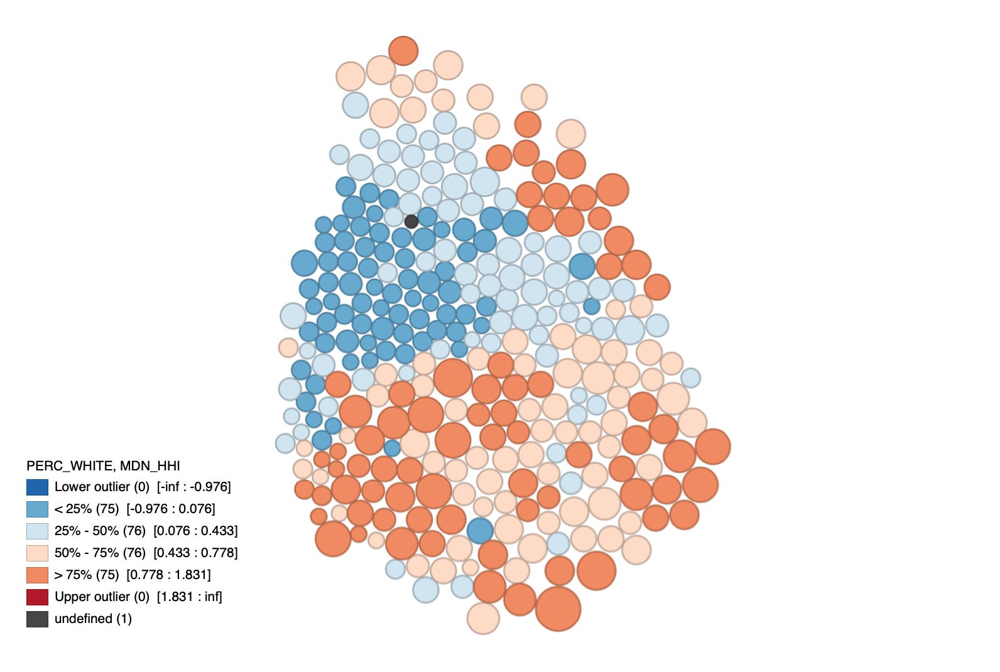

## School Performance Scores

# Results
\label{sec:results}

## Local Moran's I

### Median Household Income
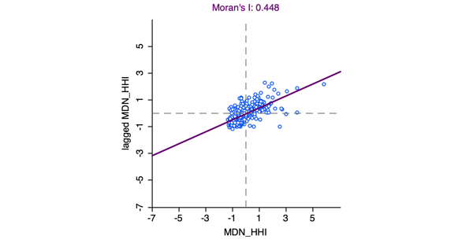{width=75% height=75%}

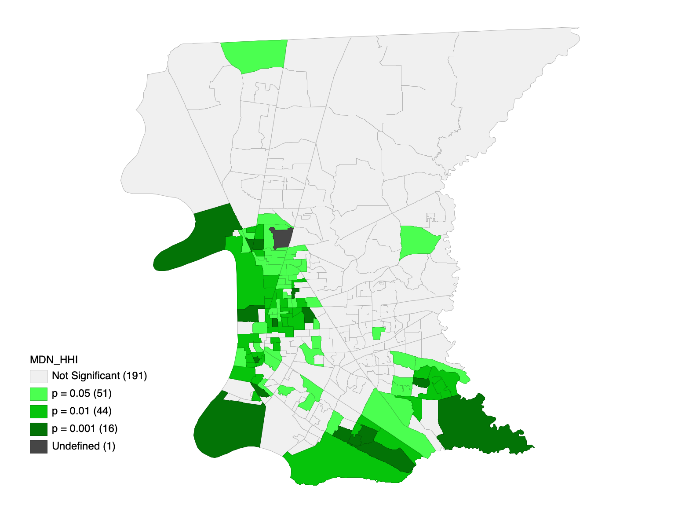

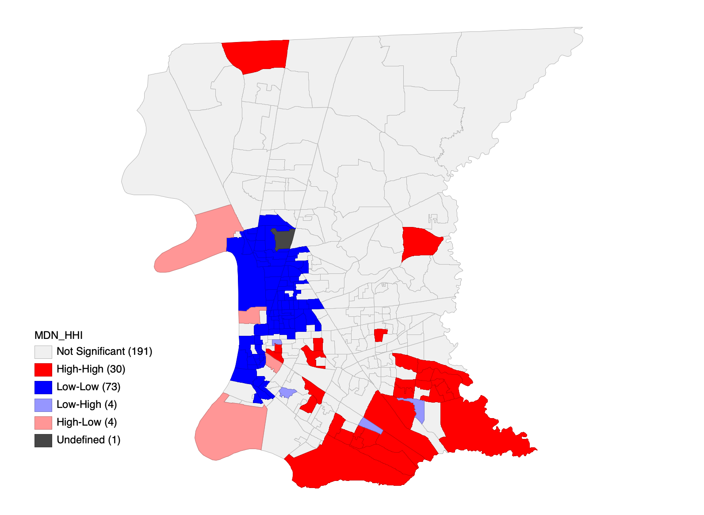

### Population Percentage White
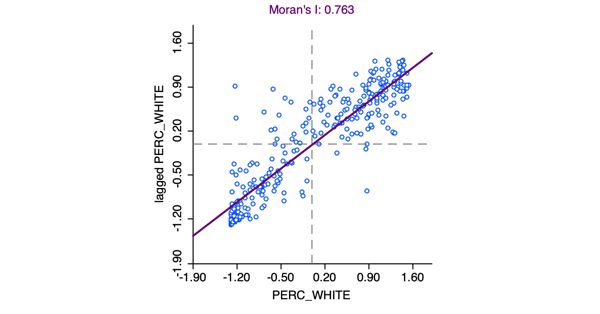{width=75% height=75%}

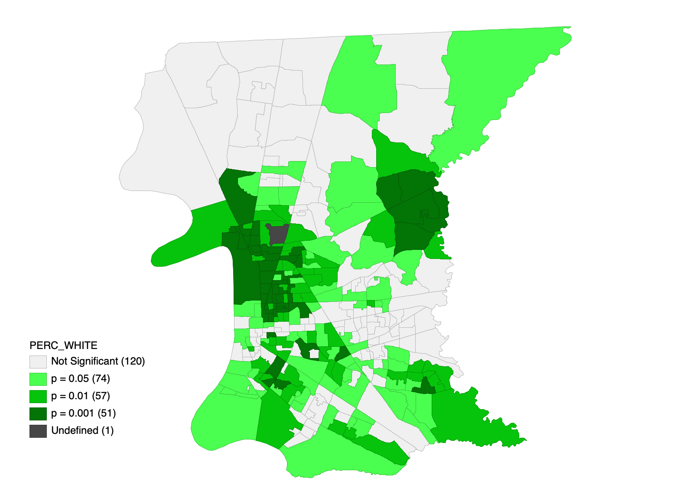

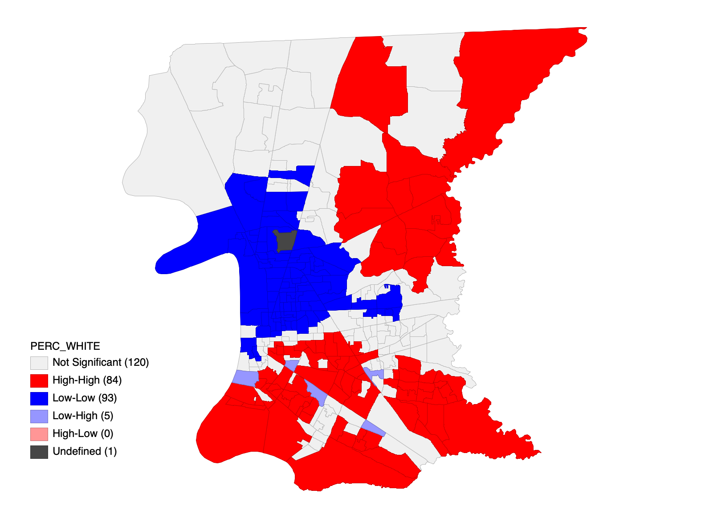

## Local Moran's I with EB rates
- Population Percentage White

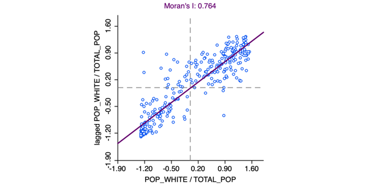{width=75% height=75%}

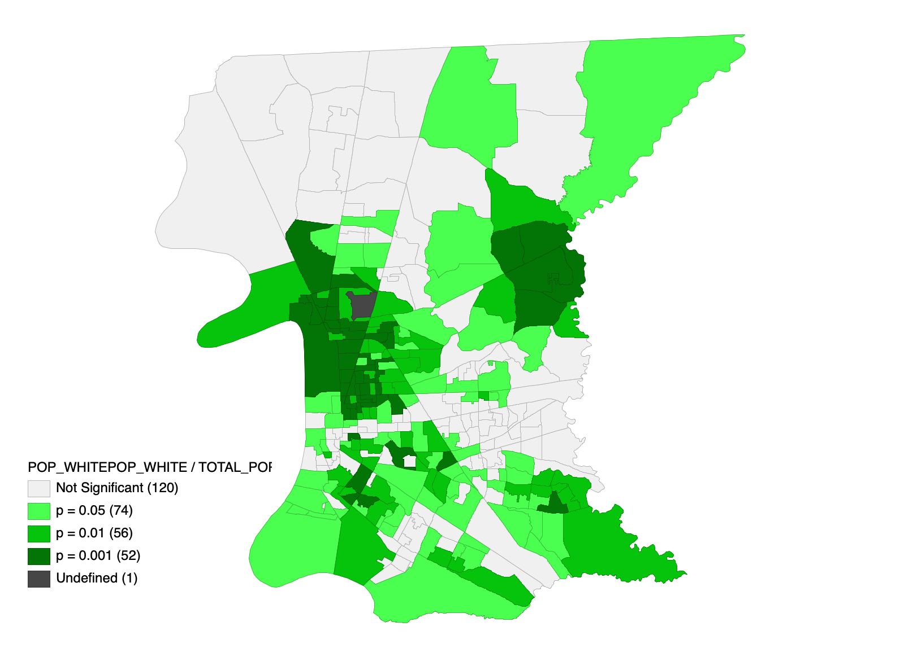

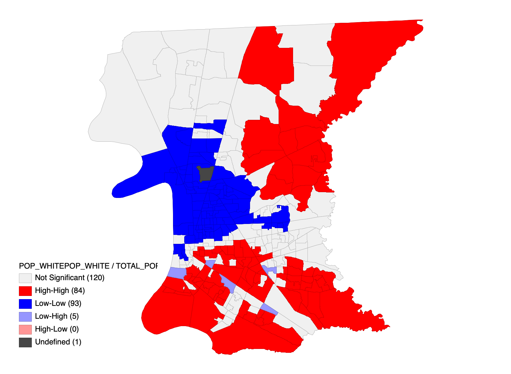

## Bivariate Local Moran's I
- Median Household Income vs Lagged Population % White

{width=75% height=75%}

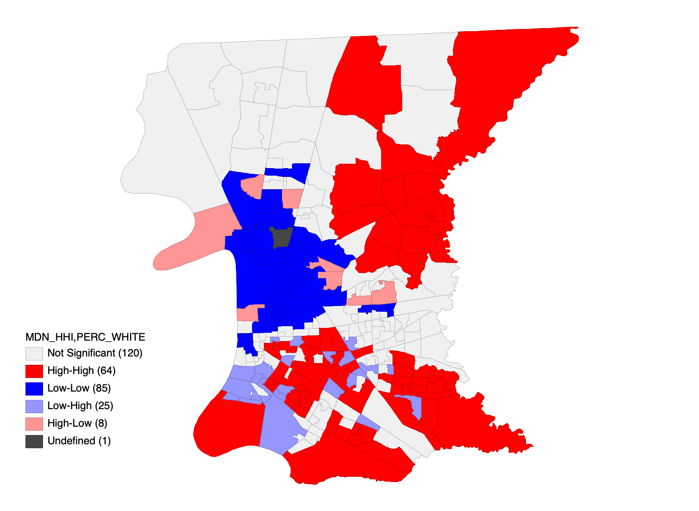

## OLS Regression

## Spatial Regression

# Discussion

# Citations
