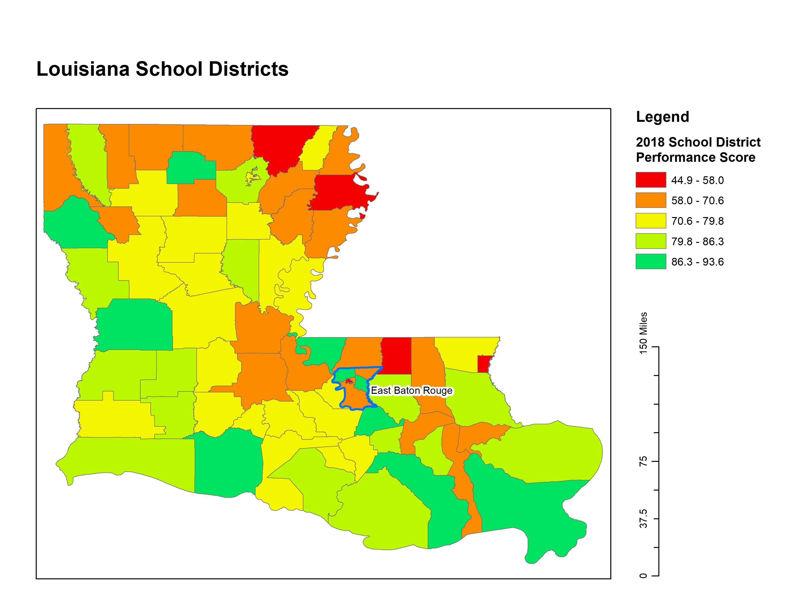
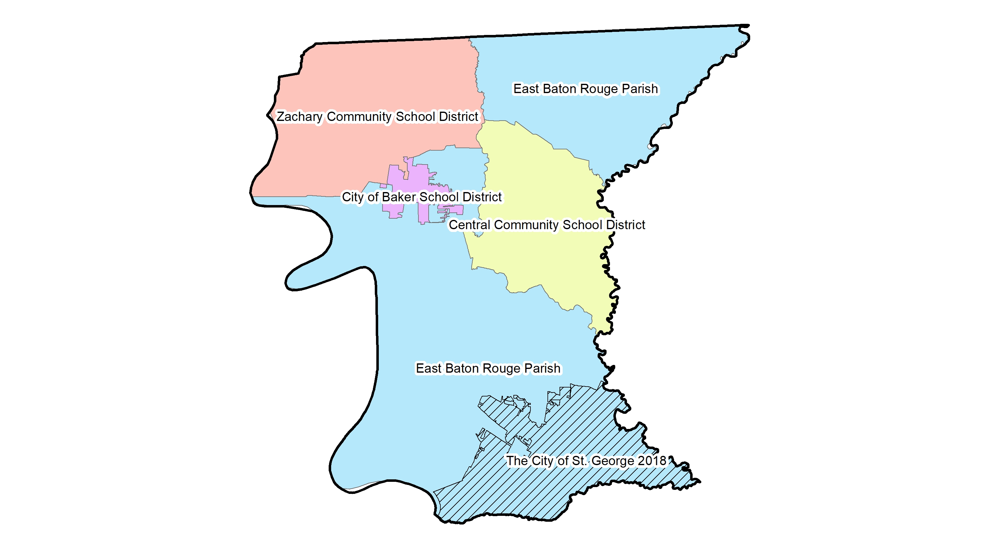

# Proposal

I am interested in examining the relationships between school performance, race, and socioeconomic indicators (including income and percentage of "economically disadvantaged"^[I use the Louisiana Department of Education’s data on percentages of economically disadvantaged students. I have yet to find sufficient metadata explaining how they define "economically disadvantaged," but comparing current school and school district performance reports with past reports suggests that this may be the percentage of students on free or reduced lunch plans.] students). Furthermore, I am interested in examining this data within the context of school district "secession."^[See @lockhart_smaller_2019 for a thorough explanation of the school district "secession" phenomenon.] I have chosen to focus on schools within East Baton Rouge Parish, Louisiana for two reasons: (1) there are stark differences among school districts with regard to school and school district performance,^[@lussier_baton_2019] and (2) residents in the southeast corner of the Parish recently voted to incorporate as the City of St. George with the intention of forming a new school district.^[@vincent_city_2019] If successful in creating a new school district, St. George will be the fourth new district to “secede” from the original East Baton Rouge Parish School District in two decades.

I propose to investigate the following research questions:

* Is there evidence that suggests the clustering of racial groups in East Baton Rouge (EBR) Parish?
* Is there evidence of the clustering of income levels in EBR Parish?
* Is there evidence of racial stratification of income?
* Is there evidence to suggest that school performance is linked to the racial makeup of the student body, the percentage of economically disadvantaged students, and/or the percentage of students fully proficient in English?

# Abstract

# Introduction

School district secession in the U.S. is propelling the re-segregation of public schools and school districts across the nation.^[@lockhart_smaller_2019] Two metrics commonly used to assess segregation include (1) “exposure” or “isolation,” which measure the relative proportion of racial groups in distinct geographic areas (schools, school districts, census block groups, counties, etc.), and (2) “unevenness,” which is concerned with the distribution of racial groups across these geographic regions.^[@chang_data_2018]

Another piece of this puzzle is the racial segregation between private versus public schools. This could be a significant factor fueling the difference in racial compositions between the total populations of residential areas and their public student populations. For example, if private schools tend to have significantly higher shares of White students than public schools in the same geographic region, this may help explain why public student populations tend to be significantly less White than the total residential populations of school districts.

{width=75% height=75%}

I have chosen to use East Baton Rouge Parish in Louisiana as a case study because this Parish is split into multiple school districts, which is not the case for many parishes in Louisiana (and counties across the South, generally speaking). Furthermore, there has been a marked difference in school performance among these districts, with Zachary Community School District consistently performing as the top-ranked school district in the state, Central Community School District regularly performing in the top five school districts in the state, and both East Baton Rouge Parish School District and City of Baker School District generally scoring in the bottom fifteen school districts in the state.^[@noauthor_2018_2018-1] There is therefore a clear disparity among school districts in this region with respect to school quality. I am interested in investigating whether there are similar disparities among East Baton Rouge Parish school districts with regard to race and socioeconomic indicators.

East Baton Rouge Parish is no stranger to this school district “splintering” phenomenon. Originally, the entire Parish comprised a single school district, the East Baton Rouge Parish School System. Then, in 2003, both Zachary Community School District and the City of Baker School District formed, largely based on the incorporated regions of the two pre-existing cities. In 2007, another section of the East Baton Rouge Parish School District split off to form Central Community School District in the eastern part of the Parish. The Central Community School District was allowed to form only after the region incorporated into a city.^[@lussier_second_2019] In 2012 and 2013, residents of the southeast section of East Baton Rouge Parish began petitioning to form a new school district.^[@lussier_second_2019] Their initial efforts ultimately fell short, but after waiting the mandated time period, the group began petitioning again in March 2018 with the intention of following Central’s example: residents planned to incorporate as the City of St. George in order to subsequently form a new school district based on the incorporated region.^[@lussier_second_2019] According to U.S. Census survey estimates, there were approximately 16,300 students from kindergarten through 12th grade in census tracts fully or partly included within the City of St. George boundaries, 7,700 of whom were enrolled in private schools.^[@lussier_st_2019]

{width=75% height=75%}

# Methods
\label{sec:methods}

I gathered data from the Louisiana Department of Education, the U.S. Department of Education’s National Center for Education Statistics, East Baton Rouge GIS Open Data, the U.S. Census Bureau, and the City of St. George’s website.

Feature classes used in the final project include:

- East Baton Rouge Parish boundary (polygon)
-	U.S. Census Bureau Unified School Districts for Louisiana (polygon)
-	East Baton Rouge Parish schools (point)
-	St. George area (polygon)
-	East Baton Rouge Parish Census Block Groups (polygon)

Tabular data joined to spatial feature classes include:

- East Baton Rouge private schools’ enrollment by race data for 2017-2018 academic year
-	East Baton Rouge public schools’ enrollment by race, school performance scores, percentage of economically disadvantaged students, and percentage of fully English proficient students data for 2017-2018 academic year
-	School district enrollment by race and school district performance scores for 2017-2018 academic year

After downloading these various data sources, I then performed the following operations: data cleaning, file format conversion, new field calculation, attribute table editing, table joining, clipping, selecting by location, and selecting by attribute. I cleaned the tabular data extensively in R and converted the .xls files to .csv files so as to prevent significant issues in importing the data into my ArcMap project. For the City of St. George polygon layer, I downloaded the KML file from Google Maps linked on the St. George website; I then used ArcCatalog to convert the KML file to a layer package I could import into ArcMap. Once I added the layers in ArcMap and created a geodatabase for the project in which I saved the various files, I began calculating new fields based on existing variables in the attribute tables. Namely, I calculated the percentage of White students and the percentage of non-White students for each school and school district in the Louisiana Department of Education data tables. I joined the Louisiana Department of Education school enrollment and performance data table and the National Center for Education Statistics private school data to the East Baton Rouge Parish schools point feature class, keeping only the records with corresponding matches (colleges and universities, for example, were included in the East Baton Rouge Parish schools layer, but they were not relevant to my analysis). I clipped the U.S. Census Bureau Unified School Districts for Louisiana to only select those within the East Baton Rouge Parish boundary. Then, I joined the Louisiana Department of Education school district performance data table to the school districts feature class. This was only possible after I started an editing session and edited values in the “School System” field of the tabular data to ensure that the names matched exactly with the names used in the East Baton Rouge Parish school districts feature class (for example, the “City of Baker School District” does not match “Baker City School District” even though they refer to the same school district).

I conduct two analyses, one taking the census block groups as the units for analysis and one taking the schools as the units for analysis.

## Census Block Groups

For the census block groups, I focus on median household income and the percentage of the population that identifies solely as White. I construct a spatial weights matrix using Queen's case first-order such that each census block group's neighbors are its immediately adjacent census block groups.

- Local Moran's I
- Local Moran's I with EB rates
- Bivariate Local Moran's I

## Schools

To address my research questions focused on schools, I investigate the relationships between school performance scores, the percentage of the student body that identifies as White, the percentage of students who are economically disadvantaged, the percentage of students who are fully proficient in English, and the size of the school (as measured by the total number of non-pre-kindergarten students). I construct a spatial weights matrix using the distance band approach, where the threshold is set such that every point has at least one neighbor; I also apply inverse distance weighting.

I conduct two regressions, one with the percentage of economically disadvantaged students as the response variable, and the second with school performance scores as the response variable. Using GeoDa, I begin with ordinary least squares (OLS) regression and select the spatial weights matrix in order to view the spatial diagnostics. Based on the regression output, I then determine whether spatial regression is appropriate. If so, I apply either the spatial lag model or the spatial error model.

# Results
\label{sec:results}

## Local Moran's I

\begin{figure}
\centering
\includegraphics[width=0.75\textwidth]{../local_morans_i/univariate/Median_Household_Income/Census_Block_GroupLisaScatterPlotFrame.png}
\caption{Lagged median household income versus median household income.}
\label{fig:scatter_mhhi}
\end{figure}

### Median Household Income

\begin{figure}
\centering
\includegraphics[width=0.5\textwidth]{../local_morans_i/univariate/Median_Household_Income/SigMap.png}
\caption{Significance map: median household income.}
\label{fig:sig_mhhi}
\end{figure}

In Figure \ref{fig:sig_mhhi}, we see statistically significant evidence of clustering in the southwestern and southeastern parts of the Parish. The general trend indicates spatial autocorrelation, as is evident in the LISA scatter plot (see Figure \ref{fig:scatter_mhhi}) and the cluster map (see Figure \ref{fig:cluster_mhhi}). In the southeastern foot of the Parish (where the City of St. George lies), we see significant clustering of census block groups with a higher-than-average median household income. In the central western area, we see mostly low-low clusters, indicating census block groups with lower-than-average median household income surrounded by neighboring census block groups with lower-than-average median household income. While there are a handful of high-low and low-high outliers, most of the significant census block groups show evidence of spatial autocorrelation. As mentioned above, the large pocket of high-high clustering overlaps largely with the City of St. George, whereas the low-low clusters are in the more densely populated part of the Parish which falls within East Baton Rouge Parish School District.

\begin{figure}
\centering
\includegraphics[width=0.5\textwidth]{../local_morans_i/univariate/Median_Household_Income/ClusterMap.png}
\caption{Cluster map: median household income.}
\label{fig:cluster_mhhi}
\end{figure}

### Population Percentage White

\begin{figure}
\centering
\includegraphics[width=0.75\textwidth]{../local_morans_i/univariate/Pop_Perc_White/Census_Block_GroupLisaScatterPlotFrame.png}
\caption{Lagged population percentage white versus population percentage white.}
\label{fig:scatter_uni}
\end{figure}

In Figure \ref{fig:sig_uni}, we see statistically significant evidence of clustering in the southwestern and southeastern parts of the Parish. The general trend indicates spatial autocorrelation, as is evident in the LISA scatter plot (see Figure \ref{fig:scatter_uni}) and the cluster map (see Figure \ref{fig:cluster_uni}). In the southern and northeastern parts of the Parish, we see significant clustering of census block groups with a higher-than-average percentage of the population that is white. In the central western area, we see mostly low-low clusters, indicating census block groups with a lower-than-average percentage of the population that is white surrounded by neighboring census block groups with a lower-than-average percentage of the population that is white. While there are a handful of statistically significant low-high outliers, most of the significant census block groups show strong evidence of spatial autocorrelation. The high-high clusters overlap to some extent with the City of St. George and Central Community School District. The low-low cluster is in the more densely populated part of the Parish which falls within East Baton Rouge Parish School District.

\begin{figure}
\centering
\includegraphics[width=0.5\textwidth]{../local_morans_i/univariate/Pop_Perc_White/SigMap.png}
\caption{Significance map: population percentage white.}
\label{fig:sig_uni}
\end{figure}

\begin{figure}
\centering
\includegraphics[width=0.5\textwidth]{../local_morans_i/univariate/Pop_Perc_White/ClusterMap.png}
\caption{Cluster map: population percentage white.}
\label{fig:cluster_uni}
\end{figure}

## Local Moran's I with EB rates

\begin{figure}
\centering
\includegraphics[width=0.75\textwidth]{../local_morans_i/univariate_EBrates/Pop_White/Census_Block_GroupLisaScatterPlotFrame.png}
\caption{Lagged population percentage white versus population percentage white (with EB rates).}
\label{fig:scatter_eb}
\end{figure}

Because the percentage of the population that is white is a proportion, it is possible that my first analysis suffered from the identification of spurious outliers. This is due to the fact that variables that are rates or proportions have inherent variance instability. When features have different population sizes, features with smaller populations have more variable rates than features with larger populations. With EB standardization, the rates are adjusted so that rates for features with small populations are pulled closer to the overall average more so than the rates for features with large populations. Note that when the base populations across all features are relatively similar (meaning there is little variance), using local Moran’s with EB rates may not be necessary. Although census block groups are statistically designed to contain roughly the same number of people, I redo the Local Moran's I analysis for the percentage of the population that identifies solely as white, applying the Empirical Bayes rate correction.

\begin{figure}
\centering
\includegraphics[width=0.5\textwidth]{../local_morans_i/univariate_EBrates/Pop_White/SigMap.png}
\caption{Significance map: population percentage white (with EB rates).}
\label{fig:sig_eb}
\end{figure}

In Figure \ref{fig:sig_eb}, we see statistically significant evidence of clustering in most parts of the Parish. The general trend indicates spatial autocorrelation, as is evident in the LISA scatter plot (see Figure \ref{fig:scatter_eb}) and the cluster map (see Figure \ref{fig:cluster_eb}). In the southern and northeastern parts of the Parish, we again see significant clustering of census block groups with a higher-than-average percentage of the population that is white. In the central western area, we see mostly low-low clusters, indicating census block groups with a lower-than-average percentage of the population that is white surrounded by neighboring census block groups with a lower-than-average percentage of the population that is white.

\begin{figure}
\centering
\includegraphics[width=0.5\textwidth]{../local_morans_i/univariate_EBrates/Pop_White/ClusterMap.png}
\caption{Cluster map: population percentage white (with EB rates).}
\label{fig:cluster_eb}
\end{figure}

In other words, the Local Moran's I with EB rates produces identical to the regular Local Moran's I analysis of this variable. As mentioned above, this is not surprising given that there is unlikely to be significant variance in the census block group populations by design.

## Bivariate Local Moran's I

\begin{figure}
\centering
\includegraphics[width=0.75\textwidth]{../local_morans_i/bivariate/MedHouseholdIncome_Lag_PercWhite/Census_Block_GroupLisaScatterPlotFrame.png}
\caption{Lagged population percentage white versus median household income.}
\label{fig:scatter_biv}
\end{figure}

The bivariate Local Moran’s I allows us to compare the spatial distribution of two variables, $X$ and $Y$ (in this case, $X$ is median household income, and $Y$ is population percentage white). For a contiguous feature set of polygons we can compare the value of $X$ at the $i^{th}$ feature to the values of $Y$ at the neighboring features, $N(i)$. This analysis allows us to determine whether there is a statistically significant relationship between $X$ and $Y$ for each feature in the analysis.

\begin{figure}
\centering
\includegraphics[width=0.5\textwidth]{../local_morans_i/bivariate/MedHouseholdIncome_Lag_PercWhite/SigMap.png}
\caption{Significance map: lagged population percentage white versus median household income.}
\label{fig:sig_biv}
\end{figure}

In Figure \ref{fig:sig_biv}, we see statistically significant evidence of clustering in most of the Parish, aside from the northwest corner. The general trend indicates spatial autocorrelation, as is evident in the LISA scatter plot (see Figure \ref{fig:scatter_biv}) and the cluster map (see Figure \ref{fig:cluster_biv}). In the southern and northeastern parts of the Parish, we see significant high-high clusters. These census block groups have a higher-than-average median household income and are neighbored by census block groups with a higher-than-average percentage of the population that is white. In the central western area, we see mostly low-low clusters, indicating census block groups with a lower-than-average median household income surrounded by neighboring census block groups with a lower-than-average percentage of the population that is white. While there are a handful of statistically significant low-high and high-low outliers, most of the significant census block groups show strong evidence of spatial autocorrelation. The high-high clusters overlap to some extent with the City of St. George and Central Community School District. The low-low cluster is in the more densely populated part of the Parish which falls within East Baton Rouge Parish School District.

\begin{figure}
\centering
\includegraphics[width=0.5\textwidth]{../local_morans_i/bivariate/MedHouseholdIncome_Lag_PercWhite/ClusterMap.png}
\caption{Cluster map: lagged population percentage white versus median household income.}
\label{fig:cluster_biv}
\end{figure}

## Regression: Percentage Economically Disadvantaged Students

In order to answer my research questions about the relationships between school performance, race, and socioeconomic status in schools, I conduct two sets of regressions. The first seeks to determine whether the percentage of white students, the size of the school (as measured by the total number of non-pre-kindergarten students), and/or the percentage of students fully proficient in English can predict the percentage of economically disadvantaged students. The second analysis focuses on how the same explanatory variables can explain school performance scores. Note that for all of my hypothesis tests I am using a confidence level of 0.95; in other words, $\alpha = 0.05$.

### OLS

\begin{figure}
\centering
\includegraphics[width=0.8\textwidth]{../spatial_regression/economically_disadvantaged/reg1_ols.png}
\caption{OLS: percentage of economically disadvantaged students versus percentage of white students, total non-pre-kindergarten students, and percentage of students fully proficient in English.}
\label{fig:ed_ols1}
\end{figure}

I begin with OLS regression (see Figure \ref{fig:ed_ols1}), focusing first on the standard OLS output to determine whether the predictors I have chosen actually hold explanatory power for the percentage of economically disadvantaged students. With my first regression, I can see that the percentage of students who are fully proficient in English is not a statistically significant predictor, with a p-value of 0.41656. The multicollinearity number, at 29.79, is quite high which is a further indication that at least one of the predictors is redundant. The other variables appear to be statistically significant, so I will run another OLS regression removing the percentage of students who are proficient in English as a predictor. For comparison, the adjusted R-squared for the first model is 0.767863, the AIC is -128.353, and the SBC is -119.417.

\begin{figure}
\centering
\includegraphics[width=0.8\textwidth]{../spatial_regression/economically_disadvantaged/reg2_ols.png}
\caption{OLS: percentage of economically disadvantaged students versus percentage of white students and total non-pre-kindergarten students.}
\label{fig:ed_ols2}
\end{figure}

For the second OLS regression (see Figure \ref{fig:ed_ols2}), we see that the percentage of white students and the total number of non-pre-kindergarten students are both still statistically significant. The multicollinearity number has decreased significantly to just 4.51, which suggests that we do not have any redundant variables. We can also confirm that this model is better than our first model because the adjusted R-squared has increased from approximately 0.768 to 0.769; also, the AIC and SBC have both decreased to about -129.6 and -122.9, respectively. We can see from the coefficient estimates that the percentage of white students has a negative relationship with the percentage of economically disadvantaged students; in other words, as the share of white students increases, the share of economically disadvantaged students decreases, indicating a significant relationship between race and socioeconomic status in schools. This suggests that schools with a larger share of minority students tend to have a larger share of economically disadvantaged students than whiter schools. Next, we examine the diagnostics.

To determine whether the assumption of normality holds, we can look at the Jarque-Bera statistic, which has a p-value of 0.00000. This suggests that our residuals do not follow a normal distribution, which violates one of the basic assumptions for OLS regression. Although this is a serious issue, it is outside the scope of this paper to address non-normality by applying a different model.

Next, we consider the diagnostics for heteroskedasticity by assessing the results of the Breusch-Pagan, Koenker-Bassett, and White tests. With $\alpha = 0.05$, we fail to reject the null hypothesis (of homoskedasticity) for each of the tests. In other words, we do not have evidence to suggest a violation of the homoskedasticity assumption.

Finally, we examine the spatial dependence diagnostics. The Moran's I analysis produces a p-value of 0.00373, which suggests spatial autocorrelation of the residuals. Similarly, the Lagrange Multiplier (SARMA) has a p-value of 0.00253, which suggests that either the spatial error model or the spatial lag model may be appropriate here. However, neither the Lagrange Multiplier (error) nor the Lagrange Multiplier (lag) produces statistically significant results for $\alpha = 0.05$. In order to investigate further, I apply first the spatial error model and then the spatial lag model in order to determine whether this is an appropriate case for the use of either model.

### Spatial Regression

\begin{figure}
\centering
\includegraphics[width=0.8\textwidth]{../spatial_regression/economically_disadvantaged/spatial_error_model.png}
\caption{Spatial error model: percentage of economically disadvantaged students versus percentage of white students and total non-pre-kindergarten students.}
\label{fig:ed_error}
\end{figure}

The spatial error model (see Figure \ref{fig:ed_error}) adds a term to the OLS regression model whose coefficient, lambda, is the coefficient for the spatial error term. The spatial error model can be represented as follows:
$$y_i = x_i \beta + \lambda w_i \epsilon_i + u_i.$$

With $\alpha = 0.05$, the estimated lambda is just barely statistically significant, with a p-value of 0.04289. To determine whether this model really is an improvement over the original model, I will also note that the R-squared is now 0.786312 (it was 0.775823 for the first model), and the AIC and SBC have both decreased. These results suggest that the spatial error model is an improvement over the regular OLS model. However, the results of the likelihood ratio test, with a p-value of 0.15678, are not statistically significant; the results of this test are inconclusive on whether the spatial error model improves upon the OLS model. Next, I consider the spatial lag model.

\begin{figure}
\centering
\includegraphics[width=0.8\textwidth]{../spatial_regression/economically_disadvantaged/spatial_lag_model.png}
\caption{Spatial lag model: percentage of economically disadvantaged students versus percentage of white students and total non-pre-kindergarten students.}
\label{fig:ed_lag}
\end{figure}

The spatial lag model (see Figure \ref{fig:ed_lag}) also adds a term to the OLS regression model; $\rho$ is the coefficient for the spatial lag term. It captures any spatial dependence in the data. The spatial lag model can be represented as follows:
$$y_i = x_i \beta + \rho w_i y_j + u_i.$$

With $\alpha = 0.05$, the estimated $\rho$ is statistically significant, with a p-value of 0.00224, and it has a negative effect. Interestingly, the magnitude of the coefficient for percentage of white students increased by a lot, from 0.727 to 0.882 for the OLS model and the spatial lag model, respectively. To determine whether this model is an improvement over the original model, I will note that the R-squared is now 0.800964 (compared to 0.775823 for the OLS model), and the AIC and SBC have both decreased. The AIC is -134.808, and the SBC is -125.871, the lowest values for AIC and SBC across all of the models thus far. These results suggest that the spatial lag model is an improvement over the regular OLS model (and is possibly a better fit than the spatial error model). The results of the likelihood ratio test, with a p-value of 0.00745, further confirm this conclusion. Based on these tests, I conclude that the spatial lag model improves upon the OLS model.

## Regression: School Performance Scores

The next series of regressions takes school performance scores as the dependent variable to see whether racial population shares, school size, and/or the percentage of students fully proficient in English can explain differences in school performance.

### OLS

\begin{figure}
\centering
\includegraphics[width=0.8\textwidth]{../spatial_regression/school_performance_2018/SPS_vs_all_minusED/reg5_ols.png}
\caption{OLS: school performance score versus percentage of white students, total non-pre-kindergarten students, and percentage of students fully proficient in English.}
\label{fig:sps_ols1}
\end{figure}

With this first regression (see Figure \ref{fig:sps_ols1}), I can see that the percentage of students who are fully proficient in English is again not a statistically significant predictor, with a p-value of 0.79535. The multicollinearity number, as before, suggests that at least one of the predictors is redundant. The other variables appear to be statistically significant, so I will run another OLS regression removing the percentage of students who are proficient in English as a predictor. For comparison, the adjusted R-squared for the first model is 0.433922, the AIC is 572.169, and the SBC is 581.106.

\begin{figure}
\centering
\includegraphics[width=0.8\textwidth]{../spatial_regression/school_performance_2018/SPS_vs_all_minusED/reg6_ols.png}
\caption{OLS: school performance score versus percentage of white students and total non-pre-kindergarten students.}
\label{fig:sps_ols2}
\end{figure}

See Figure \ref{fig:sps_ols2} for the second OLS model output. For $\alpha = 0.05$, the remaining variables remain statistically significant. The adjusted R-squared has increased to 0.441918, the first indication that this model outperforms the first OLS regression. Secondly, the AIC and SBC have both decreased: the AIC is now 570.241, and the SBC is 576.944, which is another indication that this model is a better fit. The percentage of white students and the total number of non-pre-kindergarten students both have a positive relationship with school performance; however, the coefficient magnitude is much larger for the former, suggesting that the percentage of white students has a larger impact on the school performance score. Next, I consider the regression diagnostics.

The results of the non-normality test suggest that the assumption of error normality is not violated. Furthermore, the results of the Breusch-Pagan and Koenker-Bassett tests are not statistically significant, which suggests that our assumption of homoskedasticity is valid. However, I will note that the White robust test results provide some evidence for the presence of heteroskedasticity.

The diagnostics for spatial dependence are similarly conclusive. Neither the Moran's I (error) nor the Lagrange Multiplier (SARMA) is statistically significant. Similarly, the Lagrange Multipliers for spatial lag and spatial error are not statistically significant. Based on these results, I conclude that my OLS model for school performance scores is sufficient; there is no need to perform spatial regression in this case. However, just to cover my bases, I apply a spatial error model and a spatial lag model to confirm whether either can improve upon the OLS model.

### Spatial Regression

\begin{figure}
\centering
\includegraphics[width=0.8\textwidth]{../spatial_regression/school_performance_2018/SPS_vs_all_minusED/spatial_error_model.png}
\caption{Spatial error model: school performance score versus percentage of white students and total non-pre-kindergarten students.}
\label{fig:sps_error}
\end{figure}

The spatial error model results (see Figure \ref{fig:sps_error}) show that the coefficient lambda is statistically significant, with a p-value of 0.03995. The R-squared is approximately 0.486, whereas it was about 0.458 for the OLS model; this suggests that the spatial error term helps to explain more of the observed variance in school performance scores. Similarly, the AIC and SBC have both decreased from about 570.24 to 567.98 and about 576.94 to 574.68, respectively. This is further evidence that the spatial error model improves upon the OLS model. Finally, I consider the results of the likelihood ratio test, which are statistically insignificant. Overall, the results are therefore inconclusive on whether the spatial error model greatly improves upon the OLS model; however, because the R-squared increased, and both the AIC and SBC decreased, I would say that this model is a better fit than the OLS model.

\begin{figure}
\includegraphics{../spatial_regression/school_performance_2018/SPS_vs_all_minusED/spatial_lag_model.png}
\caption{Spatial lag model: school performance score versus percentage of white students and total non-pre-kindergarten students.}
\label{fig:sps_lag}
\end{figure}

The results from the spatial lag model hypothesis tests (see Figure \ref{fig:sps_lag}) are more conclusive: this model does not appear to be an appropriate fit for the data. While the R-squared (0.460999) is slightly larger than that of the OLS model (R-squared = 0.458332), the AIC increased from 570.24 to 572.00, and the SBC increased from 576.94 to 580.93, which both suggest a worse model fit. Furthermore, the $\rho$ coefficient is relatively small in magnitude and not statistically significant ($p = 0.57263$). The likelihood ratio test is also not statistically significant, with a p-value of 0.6194. Therefore, I conclude that the spatial lag model does not provide a better fit than OLS.

# Discussion

# Citations
